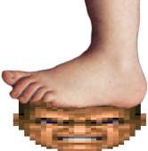

**DOOM: Squashware Edition** is a rework of the Doom Shareware IWAD
for embedded devices with restricted RAM and storage requirements. The
goal is to open the door to more "It Runs Doom!" projects.

[DOOF (Doom On One Floppy)](doof/) is a subproject that uses it to
build a version of shareware Doom that fits on one floppy disk.

What you will notice:
* IWAD file size under 2MB
* Console Doom levels
* Restricted texture set
* Shorter sound effects
* Smaller font on the menu and intermission screen
* Simplified (for size) title screen and intermission screen

What you might be less likely to notice:
* Fewer animation frames and rotations on monsters
* Fewer animations on powerup animations and other items
* Shorter music tracks

