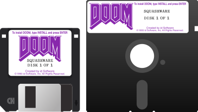

## Doom On One Floppy (DOOF)

DOOF combines Squashware Doom with the
[FastDoom source port](https://github.com/viti95/FastDoom) to create a complete
shareware version that fits on a single floppy disk (1.44 MB 3½" or 1.2 MB
5¼"). The disk is also bootable; it contains a minimal copy of
[SVARDOS](http://svardos.org/); on startup, the game files are automatically
extracted to a RAM disk and the game is then launched.
